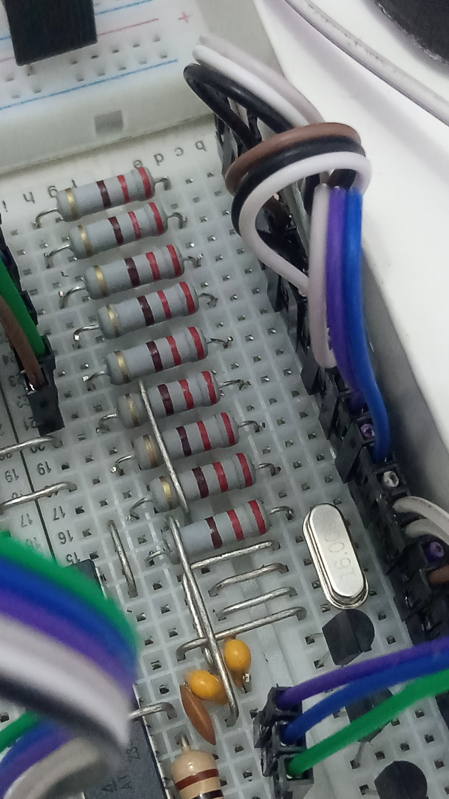
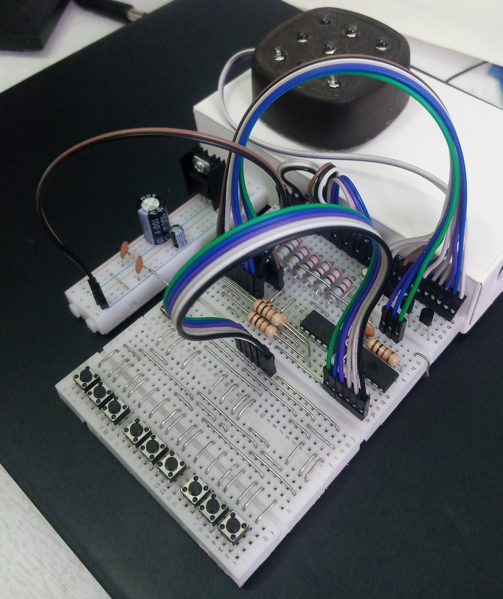
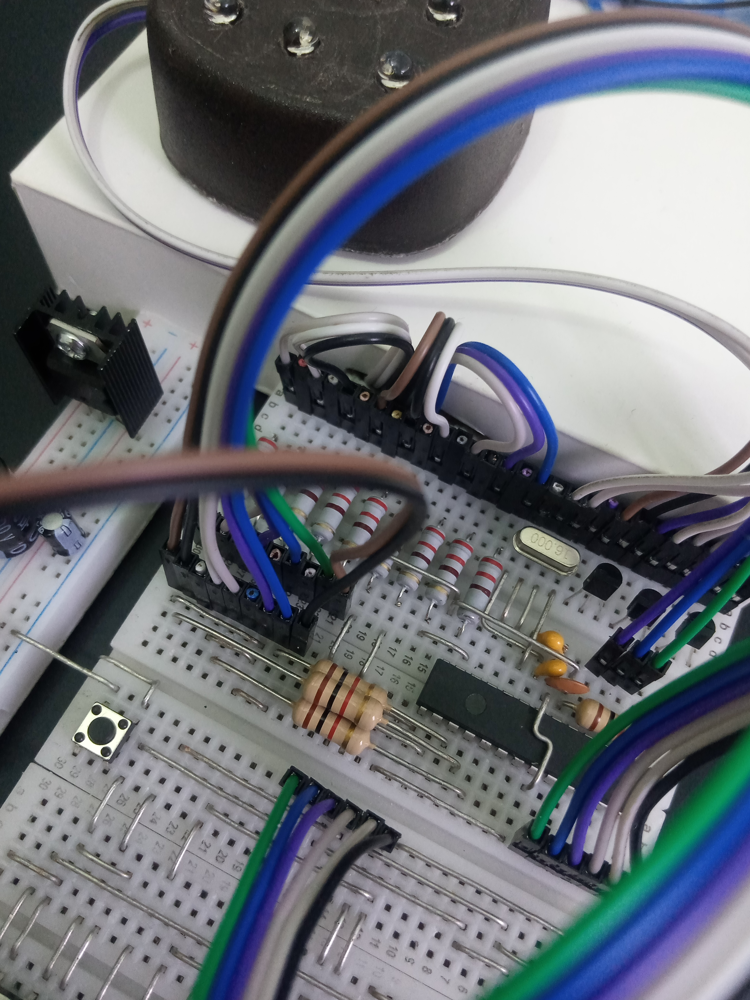
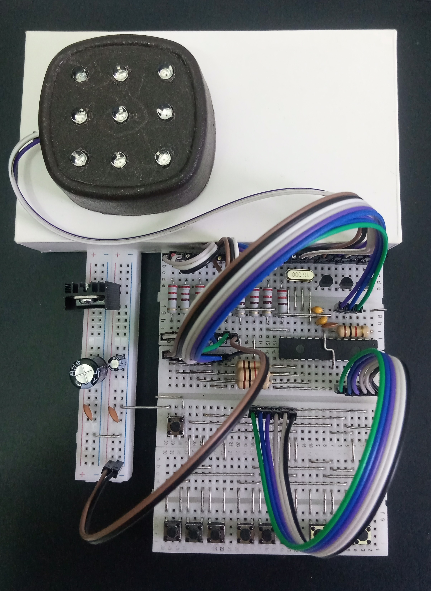
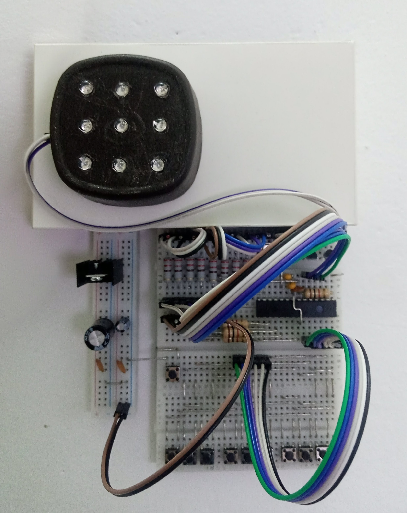

# Arduino Unbeatable Tic-Tac-Toe

A standalone ATmega328P tic-tac-toe board with a 3x3 RGB LED display, a 3x3 keypad, and an unbeatable red AI player.

The Arduino/ATmega build is the main project. The C++ command-line app is the companion toolchain used to test the game engine and generate the lookup table that the microcontroller reads from flash.

## What It Does

- The human player presses a key on the 3x3 keypad.
- The human move lights up blue.
- The ATmega reads a precomputed minimax lookup table from `PROGMEM`.
- The AI responds in red.
- A winning line is shown in green.
- After the game ends, pressing any keypad key resets the board for a new game.

Board positions are arranged like this:

```text
1 2 3
4 5 6
7 8 9
```

## Arduino Firmware

The firmware lives in [sketch/atmega/atmega.ino](sketch/atmega/atmega.ino).

It is written for an ATmega328P-style Arduino target at 16 MHz. The sketch drives the LEDs directly, scans the keypad matrix, checks wins, and uses [sketch/atmega/lut.h](sketch/atmega/lut.h) for instant AI moves.

### Pin Map

The current wiring is hardcoded in the sketch:

```cpp
const byte RED_ROW[3] = {6, 9, 3};
const byte GREEN_ROW[3] = {5, 8, 2};
const byte BLUE_ROW[3] = {4, 7, 10};
const byte COL[3] = {11, 12, 13};

const byte KP_ROW[3] = {A0, A1, A2};
const byte KP_COL[3] = {A3, A4, A5};
```

The LED grid is multiplexed. The row pins select the red, green, or blue LED anodes, and the column pins drive the cathode columns through 2N2222 transistors. The keypad uses the ATmega internal pull-ups on the column inputs.

### Build The Sketch

Install the Arduino AVR core once:

```bash
arduino-cli core install arduino:avr
```

Compile the firmware:

```bash
arduino-cli compile --fqbn arduino:avr:uno sketch/atmega
```

If you are flashing a bare ATmega328P with an ISP programmer, use the board package and upload command that match your bootloader/fuse setup. The code expects the same 16 MHz clock used by the hardware build.

## Component List

- x1 LM7805 Positive Voltage Regulator TO-220 5V
- x2 Ceramic Capacitor 22pF 50V
- x1 Crystal 16.000MHz 49S 20PPM 20pF 40 ohm
- x1 ATMEGA328P-PU Microchip AVR Microcontroller 8bit 20MHz 32 kB Flash DIP-28
- x10 Carbon Resistor 1k ohm 0.25W Through Hole
- x10 Carbon Resistor 220 ohm 0.25W Through Hole
- x10 Mini Push Button Switch 4-Pin 6x6x5mm
- x2 Breadboard 400 points
- x2 Capacitor 100uF 16V
- x10 RGB Clear LED Common Cathode 5mm
- x30 Jumper Wire 20 cm Male To Male Pin
- x10 Jumper Wire 20 cm Male to Female Pin
- x20 Carbon Resistor 27k ohm 0.25W Through Hole
- x1 Adapter 9V 1A with Single Jack 5.5x2.5mm
- x4 Ceramic Capacitor 100nF 50V
- x3 2N2222 NPN Bipolar Transistor 30V 600mA TO-92

## Hardware Notes

- Use the LM7805 to regulate the 9V adapter down to 5V.
- Place 100nF decoupling capacitors close to the ATmega power pins.
- Use the 16 MHz crystal with the two 22pF capacitors for the external clock.
- Pull RESET up to 5V with a resistor.
- The RGB LEDs are common cathode.
- The board uses 9 LEDs and 9 buttons; the extra parts are useful spares.
- Keep the hardcoded pin order unless you also update the sketch and calibration notes.

## AI Lookup Table

The ATmega does not run minimax at game time. Instead, the host tools generate a 19,683-entry table, one entry for every possible base-3 board encoding.

The generator is [generate_lut.cpp](generate_lut.cpp). It:

- skips invalid, terminal, impossible, and non-AI-turn boards with `0xFF`;
- chooses the best red AI move using the shared engine in [engine.h](engine.h);
- packs the primary move into the high nibble;
- stores an equal-score alternate move in the low nibble when one exists;
- writes a C header containing `BEST_MOVE[19683]`.

Build the host tools:

```bash
cmake -S . -B build
cmake --build build
```

Regenerate the LUT used by the sketch:

```bash
./generate_lut
cp lut.h sketch/atmega/lut.h
```

## Command-Line App

The CLI app is the desktop version of the same game logic. It is useful for testing the engine before burning a new table into the Arduino sketch.

Run it after building with CMake:

```bash
./game
```

Input uses `b1` through `b9` for the blue human player:

```text
b5
b9
b2
```

Other commands:

```text
reset
q
```

CLI symbols:

- `0` means empty.
- `b` means blue user.
- `r` means red AI.
- `g` marks the winning line.

## Host Tools

- [main.cpp](main.cpp) starts the CLI app.
- [app.h](app.h) handles CLI input, rendering, and game flow.
- [engine.h](engine.h) contains board inspection, base-3 encoding, minimax, scoring, and LUT move packing.
- [codec_tool.cpp](codec_tool.cpp) checks board encode/decode behavior.
- [generate_boards.cpp](generate_boards.cpp) writes all legal reachable board states.
- [generate_lut.cpp](generate_lut.cpp) writes the packed AVR lookup table.
- [boards.txt](boards.txt) is the generated legal-board list.
- [sketch/atmega/atmega.ino](sketch/atmega/atmega.ino) is the Arduino firmware.
- [sketch/atmega/lut.h](sketch/atmega/lut.h) is the generated `PROGMEM` table used by the firmware.
- [blueprint.txt](blueprint.txt) and [CALIBRATION.md](CALIBRATION.md) document wiring and calibration notes.

## Build Album

- Build photo 1 
- Build photo 2 
- Build photo 3 
- Build photo 4 
- Build photo 5 
